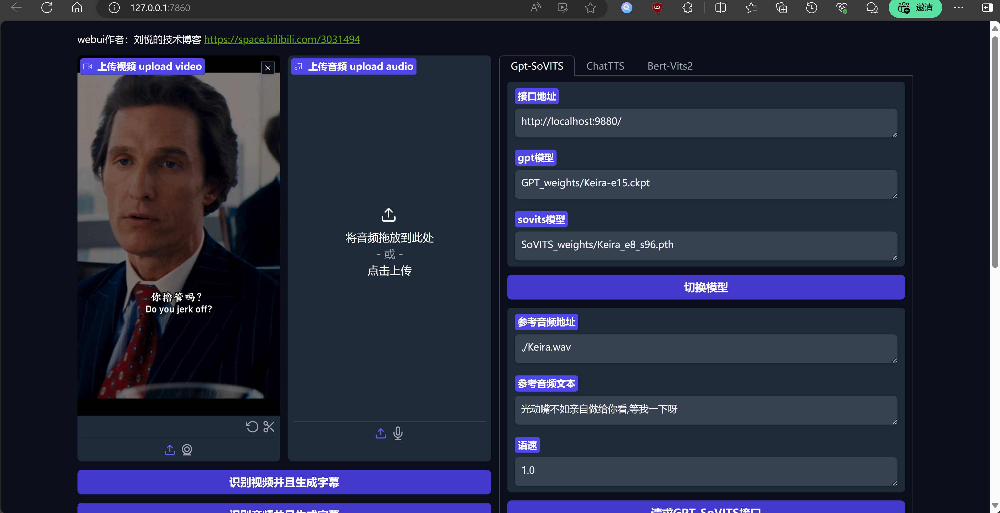

<div align="center">

<h1>鬼畜视频配音字幕同步项目</h1>

<h2>基于字幕文件同步接入TTS，支持GPT-Sovits ChatTTS BertVits2</h2>

<h2>本项目基于 https://github.com/YYuX-1145/Srt-AI-Voice-Assistant 修改</h2>

<br><br>


</div>

------


### Quick Install with Conda

```bash
conda create -n venv python=3.11
conda activate venv
```


#### Pip Packages

```bash
pip install -r requirements.txt
```

```bash

pip install torch torchvision torchaudio --index-url https://download.pytorch.org/whl/cu121
```


#### FFmpeg

##### Conda Users
```bash
conda install ffmpeg
```

##### Ubuntu/Debian Users

```bash
sudo apt install ffmpeg
sudo apt install libsox-dev
conda install -c conda-forge 'ffmpeg<7'
```

##### MacOS Users

```bash
brew install ffmpeg
```

##### Windows Users

```bash
winget install ffmpeg
```

or

```
choco install ffmpeg
```

## how to use

```
python3 launch.py
```



## Credits

https://github.com/YYuX-1145/Srt-AI-Voice-Assistant


